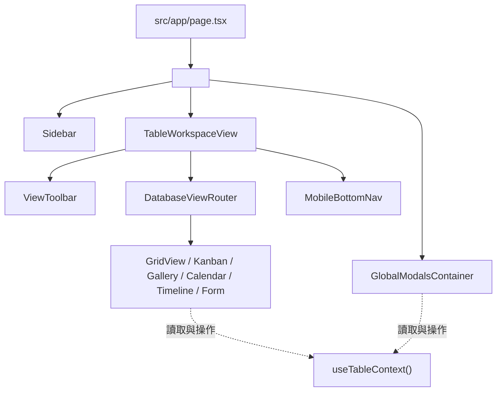

# Database 模組架構說明 (ARCHITECTURE)

## 📌 架構總覽
本模組參考 Baserow 設計，採用 **Clean Architecture** 與單向資料流。透過 `TableContext` 集中管理狀態，解構業務邏輯至專屬 Hooks，後端以 `withApiHandler` 統一控管權限、限流與驗證。

---

## 📁 核心目錄結構

```
src/
├── app/api/                   # Next.js 15+ App Router REST API 端點
├── lib/                       # 全域工具庫
│   ├── api-handler.ts         # 後端 API 統一中介層 (withApiHandler)
│   ├── authorize.ts           # RBAC 權限校驗
│   ├── formula.ts             # 公式計算引擎
│   └── rate-limiter.ts        # Redis 滑動視窗限流
├── styles/                    # 模組化樣式 (tokens, layout, toolbar, grid, components)
└── modules/database/          # 資料庫核心模組
    ├── components/
    │   ├── modals/GlobalModalsContainer.tsx # 全域彈窗容器
    │   ├── sidebar/Sidebar.tsx             # 工作區/資料庫樹狀側邊欄
    │   ├── toolbar/ViewToolbar.tsx         # 視圖工具列與篩選器
    │   └── views/
    │       ├── DatabaseViewRouter.tsx      # 多視圖切換派送器 (Grid/Kanban/Gallery 等)
    │       └── TableWorkspaceView.tsx      # 主工作區容器
    ├── context/TableContext.tsx            # TableProvider 與 useTableContext()
    ├── hooks/                              # 業務邏輯 Hooks
    │   ├── useCellEdit.ts                  # 儲存格編輯與防抖
    │   ├── useFieldOperations.ts           # 欄位 CRUD 與型別轉換
    │   ├── useMoveOperations.ts            # 跨表剪貼搬移
    │   ├── useRealtimeSync.ts              # WebSocket 即時同步
    │   ├── useRowOperations.ts             # 資料列 CRUD 與拖曳排序
    │   ├── useTableCSV.ts                  # CSV 匯入匯出
    │   └── useViewConfig.ts                # 視圖設定與篩選/排序/分組
    ├── services/                           # API 通訊服務層
    ├── store/                              # 全域輕量 Store (Auth/Theme/UI/Workspace)
    ├── types/                              # TypeScript 型別定義
    └── utils/                              # 工具函式 (normalizeRowData 等)
```

---

## 🏛️ 元件與資料流 (Component Tree)



---

## 🪝 業務 Hooks 職責切分

| Hook | 職責與涵蓋功能 |
|---|---|
| `useRowOperations` | 資料列 CRUD、批次新增與拖曳排序 (`handleReorderRows`) |
| `useCellEdit` | 儲存格雙擊編輯、更新防抖、並行取消與公式級聯計算 |
| `useViewConfig` | 視圖 CRUD、篩選 (`filterRules`)、多欄排序 (`sortRules`)、分組與欄寬持久化 |
| `useFieldOperations` | 自訂欄位建立、重命名、刪除與雙向 Link Row 聯動 |
| `useMoveOperations` | 跨表資料列剪下、暫存與批次貼上 |
| `useRealtimeSync` | Pusher WebSocket 即時協同監聽與同步 |
| `useTableCSV` | 表格 CSV 檔案匯出與批次解析匯入 |

---

## 🎨 模組化樣式分層 (`src/styles/`)

原 3,218 行單一 `globals.css` 拆分為 5 大領域模組，兼具效能與維護性：

| 樣式檔案 | 職責範圍 |
|---|---|
| `tokens.css` | 設計變數（顏色、間距、圓角）、深淺主題、雙層導角 Utility（`.bezel-container`）與全域 Resets |
| `layout.css` | 雙欄版面（`.layout`）、側邊欄導覽（`.sidebar`）、工作區樹狀清單（`.tree`）與響應式 RWD |
| `toolbar.css` | 頂部導覽列（`.toolbar`）、視圖切換 Pills（`.view-pill`）、搜尋框與篩選面板 |
| `grid.css` | 試算表格本體（`.grid-table`）、儲存格渲染、欄寬調整 Handle、高亮列染色 |
| `components.css` | 彈窗容器（`.modal`）、按鈕系統（`.button`）、右鍵選單（`.context-menu`）、Toasts 提示與動畫 |

---

## 🛡️ 後端 API 中介層 (`withApiHandler`)

所有 API 路由皆透過 `withApiHandler` 提供統一的型別解析、RBAC 與限流保護：

```typescript
import { withApiHandler } from '@/lib/api-handler'
import { z } from 'zod'

export const POST = withApiHandler(
  async ({ params, body, auth }) => {
    // 業務邏輯：已保證通過登入、RBAC 權限與 Zod 型別校驗
    return { ok: true }
  },
  {
    auth: { action: 'canEditData' },
    rateLimit: { limit: 60, windowSeconds: 60 },
    bodySchema: z.object({ name: z.string().min(1) }),
  }
)
```
